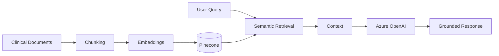
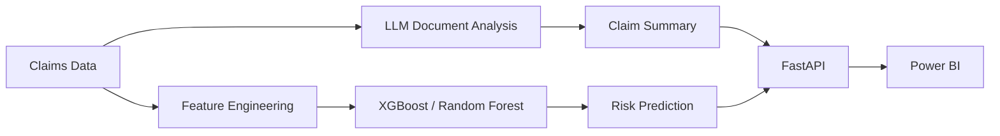

<div align="center">


<br/>

[](mailto:belidesahith647@gmail.com)
[](https://github.com/belidesahith18-alt?tab=repositories)
[](#professional-experience)
[](#technical-skills)
[](#featured-projects)

<br/>


</div>

---

# 🚀 AI ENGINEERING PROFILE

Applied AI Engineer with **3+ years of experience** designing, developing, and deploying **Machine Learning and Generative AI solutions** across **healthcare and financial services**.

I work across the complete AI engineering lifecycle:

```text
Enterprise Data
      ↓
Feature / Document Processing
      ↓
Machine Learning / LLM / RAG
      ↓
Evaluation & Validation
      ↓
FastAPI Services
      ↓
Docker
      ↓
Kubernetes / AKS
      ↓
Azure Deployment
      ↓
Monitoring & Optimization
```

### CORE FOCUS


---

# 💼 PROFESSIONAL EXPERIENCE

## 🏥 CVS Health
### Applied AI Engineer | Oct 2025 – Present

**Healthcare AI • Generative AI • RAG • Enterprise Knowledge Systems**

**Core Stack**  
`Python` `Azure OpenAI` `LangChain` `RAG` `Pinecone` `PostgreSQL` `FastAPI` `Docker` `Kubernetes` `AKS` `Azure ML`

### Key Contributions
- Design and develop **LLM-powered healthcare applications** using Python, Azure OpenAI, LangChain, and Generative AI architectures.
- Build end-to-end **Retrieval-Augmented Generation pipelines** integrating enterprise documents, embeddings, semantic retrieval, Pinecone, and PostgreSQL.
- Develop LangChain workflows covering document processing, chunking, embedding generation, retrieval, prompt construction, grounding, and response generation.
- Build **FastAPI-based AI inference and retrieval services**.
- Containerize applications using **Docker** and deploy through **Kubernetes / AKS**.
- Support experimentation, deployment, evaluation, monitoring, and optimization with **Azure ML**.
- Reduced manual deployment effort by approximately **40%** through packaged AI inference APIs.

---

## 💳 Hexaware Technologies
### Machine Learning Engineer | Jun 2022 – Jul 2024

**Financial ML • Predictive Analytics • Risk Analysis • Data Engineering**

**Core Stack**  
`Python` `Pandas` `NumPy` `SQL` `XGBoost` `Random Forest` `Logistic Regression` `Azure Data Factory` `PySpark` `Apache Spark` `Power BI`

### Key Contributions
- Developed and operationalized **machine learning pipelines** for financial transaction data.
- Built supervised ML models using **XGBoost, Random Forest, and Logistic Regression**.
- Engineered predictive features using **Python, Pandas, NumPy, and SQL**.
- Designed **Azure Data Factory pipelines** for ingestion, transformation, validation, and movement.
- Developed scalable **PySpark and Apache Spark workflows**.
- Implemented automated SQL validation and data-quality checks.
- Supported end-to-end ML workflows from data preparation through deployment and iterative improvement.
- Migrated Tableau reporting workloads to **Power BI**.

---

# 🛠️ TECHNICAL SKILLS

## Programming & Data
`Python` `SQL` `Pandas` `NumPy` `PySpark`

## Applied AI & GenAI
`Generative AI` `Large Language Models (LLMs)` `Retrieval-Augmented Generation (RAG)` `LangChain` `Azure OpenAI` `Prompt Engineering` `Embeddings` `Semantic Search` `Vector Search` `AI Agents` `LLM Evaluation`

## Machine Learning
`PyTorch` `Scikit-learn` `XGBoost` `Random Forest` `Logistic Regression` `Transformers` `Natural Language Processing (NLP)` `Classification` `Regression` `Feature Engineering` `Model Evaluation`

## AI Application Development
`FastAPI` `REST APIs` `Python Microservices` `AI Inference Services` `API Integration` `Workflow Orchestration`

## Vector & Databases
`Pinecone` `PostgreSQL`

## Cloud & MLOps
`Microsoft Azure` `Azure ML` `Azure OpenAI` `Azure Kubernetes Service (AKS)` `Kubernetes` `Docker` `MLflow` `Model Deployment` `Model Monitoring`

## Data Platforms
`Databricks` `Apache Spark` `PySpark` `Azure Data Factory` `Azure Data Lake Storage (ADLS)` `ADLS Gen2` `SQL`

## Visualization & Automation
`Power BI` `Tableau` `Power Apps` `Power Automate`

---

# 🚀 FEATURED PROJECTS

## 🟣 Enterprise Clinical Knowledge Assistant

**Tech**  
`Python` `LangChain` `Azure OpenAI` `Pinecone` `FastAPI` `RAG` `Embeddings` `Semantic Search`

### Highlights
- Built a **Generative AI-powered RAG assistant** for retrieving and summarizing clinical documentation.
- Implemented LangChain-based document chunking, embedding generation, contextual retrieval, and prompt engineering.
- Integrated **Pinecone vector search** for contextual document retrieval.
- Improved retrieval relevance across **1,000+ documents**.
- Exposed the RAG pipeline through **FastAPI**.

### Architecture



---

## 🔵 Intelligent Claims & Risk Analysis Assistant

**Tech**  
`Python` `LLMs` `Machine Learning` `XGBoost` `Random Forest` `FastAPI` `Power BI`

### Highlights
- Combined an **LLM-based document understanding layer** with predictive ML models.
- Identified high-risk insurance claims.
- Generated supporting claim summaries.
- Developed a **FastAPI service** for predictions and NLP outputs.
- Created **Power BI dashboards** for risk indicators, predictions, and trends.

### Architecture



---

# 🎓 EDUCATION

## Master of Science in Information Systems
**Central Michigan University**  
Mount Pleasant, Michigan  
**May 2026**

## Bachelor of Engineering in Computer Engineering
**CVR College of Engineering**  
Hyderabad, India  
**April 2024**

---

# 📊 GITHUB ENGINEERING DASHBOARD

<div align="center">


<br/><br/>


</div>

---

# 🤝 LET'S CONNECT

<div align="center">

### Building AI systems that move from prototype to production.

[](mailto:belidesahith647@gmail.com)

[](https://github.com/belidesahith18-alt?tab=repositories)

<br/>

### DATA → MODELS → RAG → APIs → CLOUD → IMPACT


</div>
